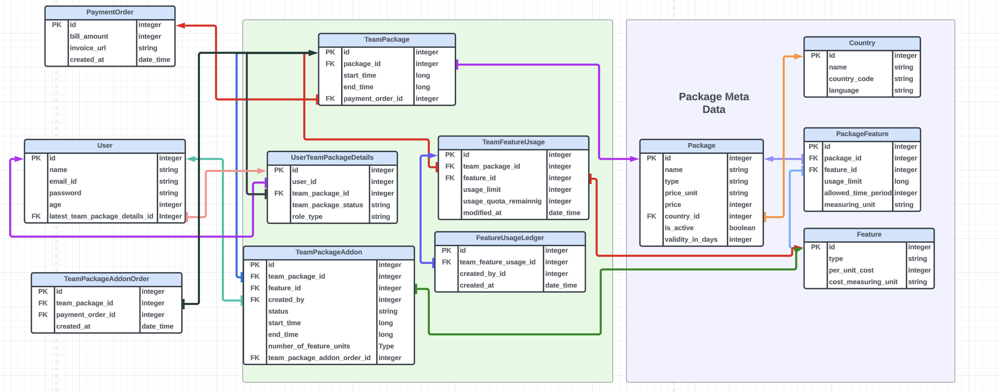

# Subscription App for Typeface ( Django )

Welcome to my project! This is a brief description about getting started

## Installation

To install the project, follow these steps:

1. Clone the repository: `git clone https://github.com/Blank000/Typeface.git`
2. Setup a python virtual env: example  - `conda create -n typeface_django python=3.8`
3. Active virtual environment - `conda activate typeface_django`
4. Install dependencies: `pip3 install -r requirements.txt`
5. Make migrations: `python3 manage.py makemigrations subscription`
6. Migrate: `python3 manage.py migrate`
7. Pre-Populate static data: `python3 manage.py populate_data`
8. Run the project: `python3 manage.py runserver`

## APIs Collection

Postman Collection - 

- https://bold-sunset-760997.postman.co/workspace/New-Team-Workspace~ed0071e2-d426-4c90-b950-9ccbf9ccf8da/collection/7965325-d4513c77-2aec-4d29-b833-cecff1af554e?action=share&creator=7965325

## Models Explaination - 

Flow - 
1. Package - (Subscription Plan)
    - Developer
        - Price - Rs 10000
        - Country - India
        - Validity in days - 30
        - Number of images allowed - 1000
        - Number of words allowed - 5000
        - Number of users allowed - 1
    - Team -
        - Price - Rs 50000
        - Country - India
        - Validity in days - 30
        - Number of images allowed - 5000
        - Number of words allowed - 20000
        - Number of users allowed - 10
    - Business -
        - Price - Rs 200000
        - Country - India
        - Validity in days - 30
        - Number of images allowed - 20000
        - Number of words allowed - 100000
        - Number of users allowed - 100
    - Enterprise - 
        - These will be dynamically created packages, created as per the request of organisations

2. Features - 
    - Number of images allowed
    - Number of words allowed
    - Number of users allowed

## ER diagram - 

## Table Details - 
1. Package
    - Contains the information about each package or subscription plan
2. PackageFeature
    - Contains relations to all the features supported by a given package.
3. Feature
    - Contains information about the feature, and will also help in bill calculation when extra add-ons are bought  
      on top of packages
4. Country
    - Contains information specific to a country. Helps us list the packages based on geographical location.
5. User
    - Contains user specific information, hashed password ( authentication ), and latest purchase information
6. TeamPackage
    - A package is bought for an team of 1 or more. It consists of the time when we want to start the package and as 
      per the package type end time can be calculated. It also consists of the payment information of the given package bought. 
    - Rows of this table will contain the information of the all the packages that a user has been involved with. It 
      along with UserTeamPackageDetails table consists of all the history.
    - Whenever a user clicks on payment from the subscription page, this table will be created along with 
      UserTeamPackageDetails with status CREATED.
7. UserTeamPackageDetails
    - As discussed above, this table along with TeamPackage helps us keep a track of all the packages created, 
      expired or active
    - There are two major benefits of having this - 
        - It maintains the status of TeamPackage and in turn it helps us directly know the status of TeamPackage 
          from user table.
        - It also maintains a role_type field, which is user centric. In case of team, we will have users with 
          different roles like admin, member, etc and as TeamPackage table is centric more towards the team, we needed it here.
    - Once the payment is successful, status is changed to ACTIVE.
8. TeamFeatureUsage
    - On a higher level this will keep track of all the usage of the features if the user is a part of active 
      TeamPackage. Here we could also define the custom logic of soft stop rather than hard stop with a added feature of warning to the user on high usage of feature.
9. FeatureUsageLedger
    - This table will store granular level data about individual user usage's corresponding to a given 
      TeamFeatureUsage
10. TeamPackageAddon
    - Similar to TeamPackage, a user has a flexbility of buying any extra add on feature either to extend it or buy 
      some extra add-on feature depending on business logic.
    - It will be attached to the active TeamPackage, so start_time can be configured but end_time could not be more 
      than the end_time of the active TeamPackage
11. TeamPackageAddonOrder
    - The reason for having this table seperately was because of how invoice against payment is generated in real 
      life.
    - If a user buys, 2-3 or more addons at a time, the invoice should be generated one time for it and not on each 
      indivudal addon.
12. PaymentOrder
    - This will maintain the billing information against each payment a user does. 
